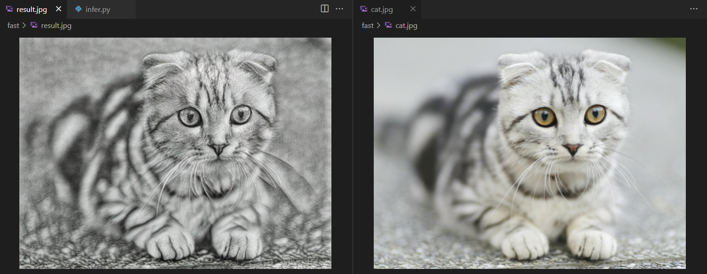

# 部署流程

本文将以部署 Fast Neural Style Transfer 为例子，简单介绍如何使用 OneFlow-Serving 走完深度学习任务的最后一公里：模型部署。OneFlow-Serving 对接了 [Triton Inference Server](https://github.com/triton-inference-server/server)，我们可以很方便的将 Triton Inference Server 丰富的特性使用起来：Dynamic batching，Model Pipelines，HTTP/gRPC 接口等。本文分为四个部分，模型保存、模型配置、启动服务、客户端发送请求。

## 模型保存

模型训练可以使用性能强大的静态图 Graph 模式，也可以使用表达灵活的动态图 Eager 模式。模型部署的时候为了充分优化性能，节省内存，OneFlow-Serving 采用静态图 Graph 模式来充分利用硬件资源。

模型部署的时候，需要模型的参数和计算图相关的信息。在 OneFlow 中，提供了 oneflow.save 用于保存模型。值得注意的是 oneflow.save 接口不仅仅可以保存 nn.Module，它还可以保存 nn.Graph！在保存 nn.Graph 的时候，会同时保存模型的参数和计算图。

**静态图训练：使用 oneflow.save 保存 nn.Graph**

```python
import oneflow as flow

graph = ... # graph is a nn.Graph
flow.save(graph, "./model")
```

graph 是一个 nn.Graph 对象，使用 flow.save 可以将这个 graph 的模型参数和计算图保存到 `./model` 目录下面。

**动态图训练：使用 oneflow.save 保存 nn.Module**

对于 nn.Module 训练的模型，利用 tracing 机制，轻易实现动静转换，把 nn.Module 转换为 nn.Graph。下面我们以 flowvision 仓库中的 neural_style_transfer 为例子，展示如何保存 nn.Module。

```python
import oneflow as flow
import oneflow.nn as nn
from flowvision.models.neural_style_transfer.stylenet import neural_style_transfer


class MyGraph(nn.Graph):
    def __init__(self, model):
        super().__init__()
        self.model = model

    def build(self, *input):
        return self.model(*input)


if __name__ == "__main__":
    image = flow.ones((1, 3, 1024, 1024))
    model = neural_style_transfer(pretrained=True, progress=True)
    model.eval()
    graph = MyGraph(model)
    out = graph(image)
    flow.save(graph, "1/model")
```

上面的代码中，定义了一个 MyGraph 类，将 nn.Module 对象作为它的成员，之后使用 “假数据”，让 “假数据” 流动一遍，从而建立计算图。于是我们从 nn.Module 对象创建出了 nn.Graph 对象，使用 flow.save 保存模型参数和计算图即可。

## 模型配置

为了使用 Triton Inference Server，我们需要按照一定的方式组织目录结构，并且编写模型配置文件。

**目录结构**

在 “模型保存” 一节中，保存了模型参数和计算图，将保存的文件按照如下方式组织。其中 `model_repository` 是模型仓库，启动服务的时候可以指定模型仓库的路径，下面的每一个文件夹就是一个模型。`fast_neural_style` 是模型仓库中的一个模型，在这个目录下面，需要放置 “只含数字” 的文件夹，表示模型的版本，默认情况下只会使用最新的版本。在某个版本文件夹下面，需要放置一个命名为 `model` 的文件夹，这个文件夹就是前面保存下来的模型参数和计算图，如果这个文件夹不存在，那么启动服务的时候会提示找不到 `model` 文件夹。

```
$ tree  -L 3 model_repository/
model_repository/
└── fast_neural_style
    ├── 1
    │   └── model
    ├── config.pbtxt
    └── labels.txt
```

**模型配置**

在模型文件夹的下面，还需要放置一个 `config.pbtxt`，它是一个 protobuf 文本格式的配置文件，里面存放了模型服务的配置，配置模型放置在哪个卡上，模型的输入输出尺度等。

首先，需要定义模型的模型和使用的后端。模型的名字是 `fast_neural_style`，特别需要注意和模型的文件夹名字要对应上。`backend` 字段设置为 `oneflow`。

```
name: "fast_neural_style"
backend: "oneflow"
```

接着，需要定义模型的输入和输出尺度。下面的输入输出名字字段，我们需要按照模型的输入输出顺序填写，并且命名格式是 `INPUT_<index>` 和 `OUTPUT_<index>`，用 `<index>` 表示模型输入的顺序，默认从 0 开始。`data_type` 字段定义了数据类型，`dims` 字段定义了向量的尺度。

```
input [
  {
    name: "INPUT_0"
    data_type: TYPE_FP32
    dims: [ 3, 1024, 1024 ]
  }
]
output [
  {
    name: "OUTPUT_0"
    data_type: TYPE_FP32
    dims: [ 3, 1024, 1024 ]
  }
]
```

以上的模型名字、后端名字、输入输出是最关键的配置，在这之外，还有很多可以灵活调配的选项，比如我们可以按照下面的设置，将模型放置在指定的 GPU 上，我们可以设置 `count` 指定放置的数量，设置 `kind` 设置方式的设备类型，设置 `gpus` 选择放置的 GPU 卡号。更多灵活调配的选项，请参考 [Triton Inference Server 的文档](https://github.com/triton-inference-server/server/blob/main/docs/model_configuration.md)。

```
instance_group [
  {
    count: 1
    kind: KIND_GPU
    gpus: [ 0 ]
  }
]
```

## 启动服务

OneFlow Serving 提供了 Docker 镜像，使用 Docker 启动模型服务。按照上面的目录结构组织好文件之后，就可以映射路径到容器中，启动服务。

```
docker run --rm --runtime=nvidia --network=host -v$(pwd)/model_repository:/models \
  oneflowinc/oneflow-serving:0.0.1
```

使用下面的命令，可以检查模型服务是否启动。看到 http 200 状态码，那么模型服务已经启动。

```
curl -v localhost:8000/v2/health/ready
```

## 客户端发送请求

为了向模型服务端发送推理请求，需要借助 tritonclient 客户端。需要先安装一个 python 包。

```
pip3 install tritonclient[all]
```

安装完毕之后，我们先编写预处理和后处理代码。

```python
import cv2
import time
import argparse
import numpy as np
import tritonclient.http as httpclient


def load_image(image_path, nh, nw):
    im = cv2.imread(image_path)
    im = cv2.cvtColor(im, cv2.COLOR_BGR2RGB)
    w = im.shape[0]
    h = im.shape[1]
    im = cv2.resize(im, (nh, nw))
    im = np.transpose(im, (2, 0, 1))
    im = np.expand_dims(im, axis=0)
    return np.ascontiguousarray(im, 'float32'), w, h


def recover_image(im, h, w):
    im = np.squeeze(im)
    im = np.transpose(im, (1, 2, 0))
    im = cv2.cvtColor(np.float32(im), cv2.COLOR_RGB2BGR)
    im = cv2.resize(im, (h, w))
    return im.astype(np.uint8)
```

之后我们可以编写如下代码，对指定参数的图片进行风格化。

```python
if __name__ == '__main__':
    parser = argparse.ArgumentParser()
    parser.add_argument('--image',
                        required=True,
                        help='the image to transfer style')
    FLAGS = parser.parse_args()
    triton_client = httpclient.InferenceServerClient(url='127.0.0.1:8000')
    image, w, h = load_image(FLAGS.image, 1024, 1024)
    inputs = []
    inputs.append(httpclient.InferInput('INPUT_0', image.shape, 'FP32'))
    inputs[0].set_data_from_numpy(image, binary_data=True)
    outputs = []
    outputs.append(httpclient.InferRequestedOutput('OUTPUT_0', binary_data=True))
    results = triton_client.infer('fast_neural_style', inputs=inputs, outputs=outputs)
    output0_data = results.as_numpy('OUTPUT_0')
    image = recover_image(output0_data, h, w)
    cv2.imwrite('result.jpg', image)
```

上面的代码中，需要先创建一个 client，设置 url。在前面启动 triton 服务端的时候，默认启动的端口是 8000。一条推理请求的数据部分，由输入和输出两部分组成，输入的数据由客户端提供，比如一张需要分类的图片；输入和输出都要设置名字，需要和前面的 `config.pbtxt` 对应。设置好了输入输出，就可以调用 client infer 接口，提供模型名字，输入，输出，这条请求就会发送到服务端进行推理了。

我们对一只猫进行推理，可以得到如下结果。

```
$ curl -o cat.jpg https://images.pexels.com/photos/156934/pexels-photo-156934.jpeg
$ python client.py --image cat.jpg 
```

风格化后的图片如下所示：


